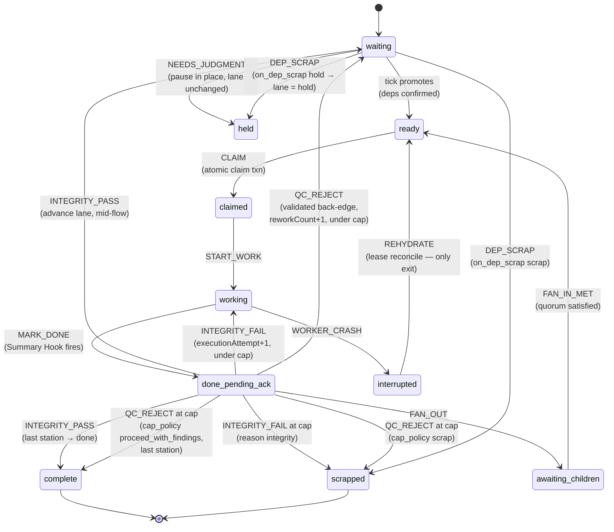
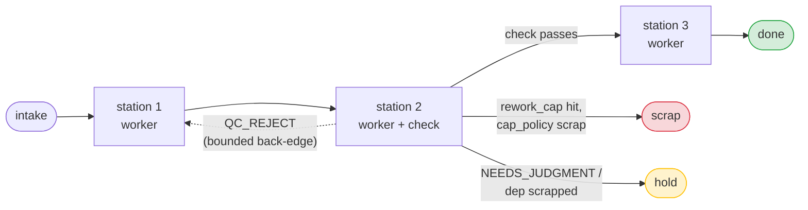
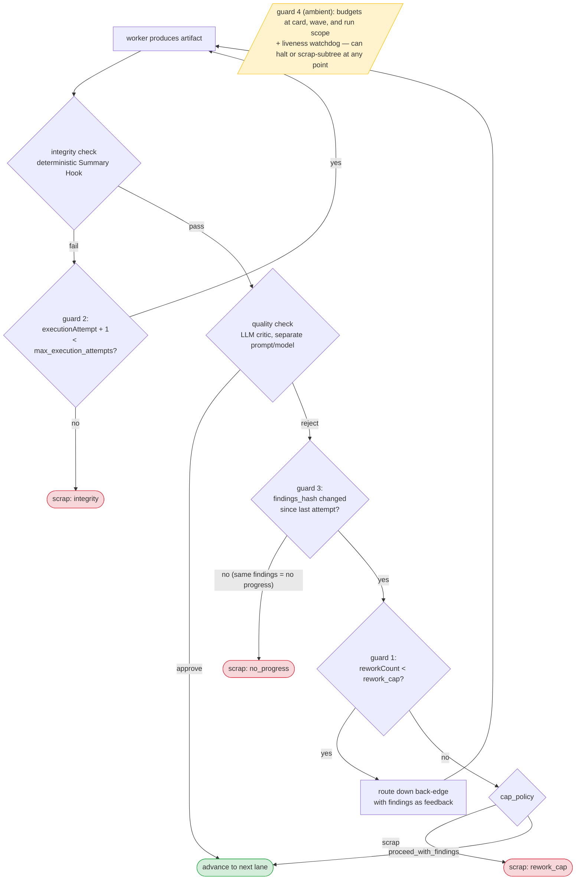
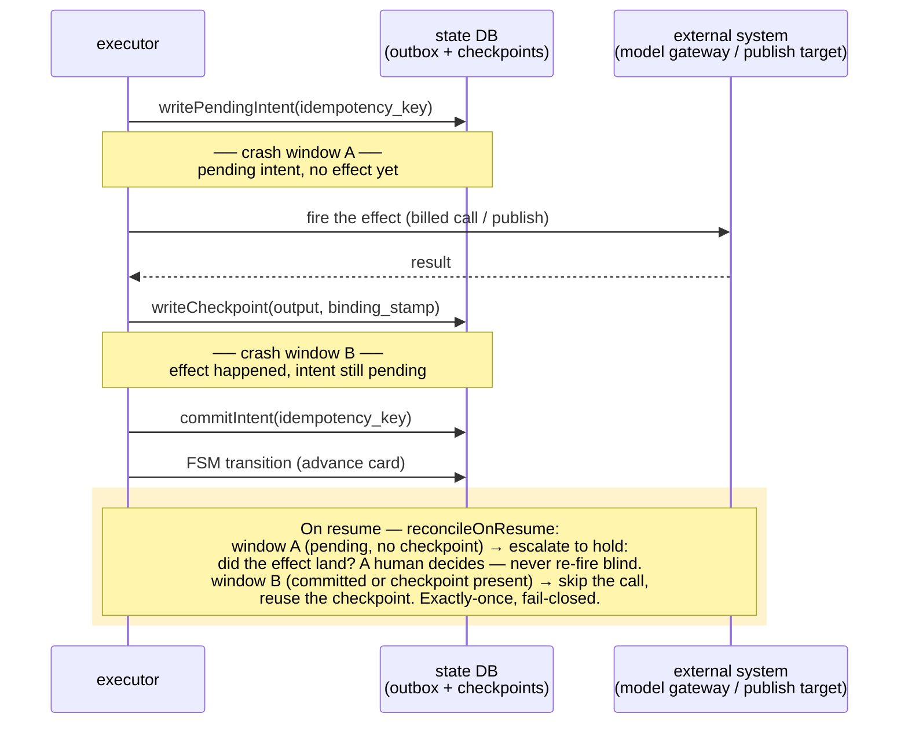
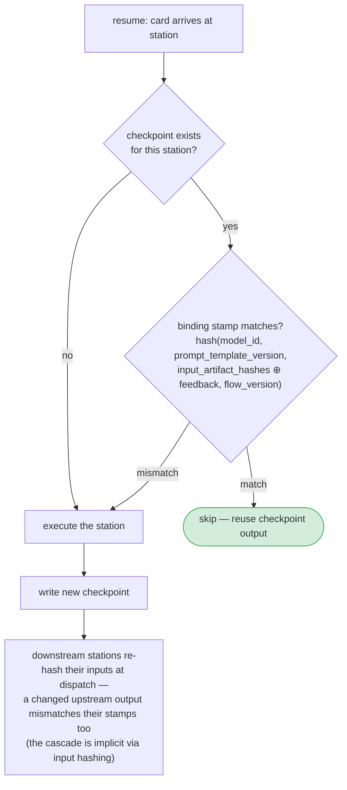
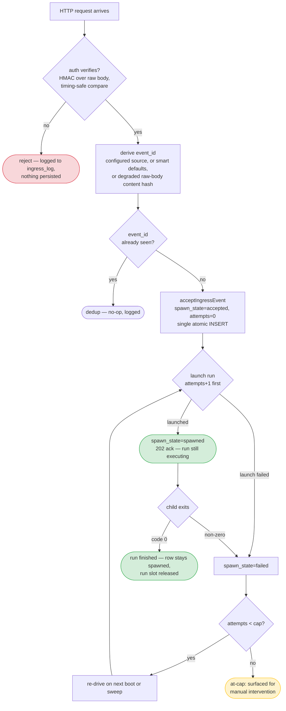
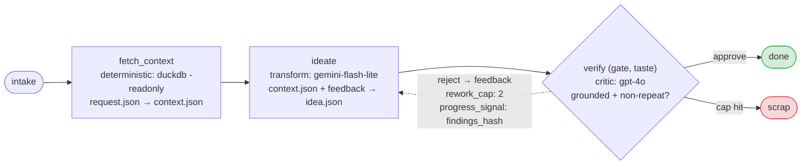
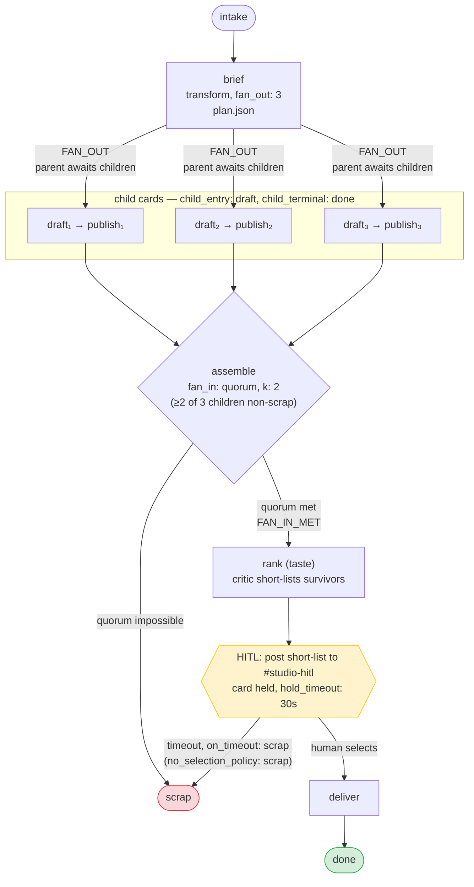
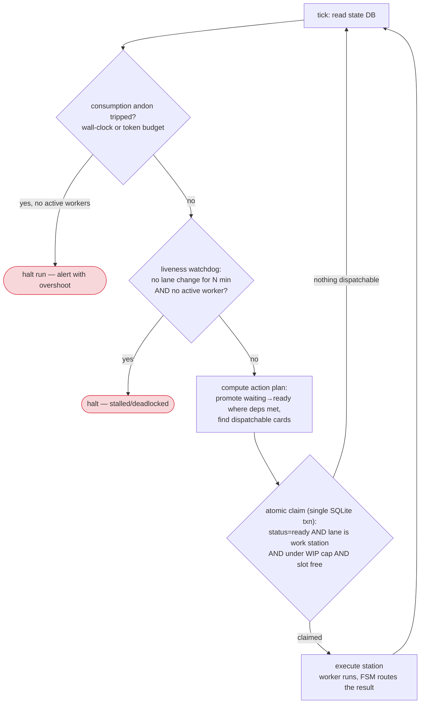

# Diagrams

Mermaid diagrams of the flows through the Conduit kernel. Each diagram is drawn from the
*code*, not the SPEC's idealized version — sources are cited per diagram. Terms:
[`glossary.md`](./glossary.md).

---

## Rendering `flow.yaml`

Use `conduit explain` to inspect the compiled topology without starting a run:

```sh
conduit explain path/to/flow.yaml
```

The command loads the same fail-closed `flow.yaml` config as `conduit run`, then
prints a read-only topology explanation. It never opens the state DB, calls a
model, or starts workers.

In an interactive terminal, the rich view shows:

- a compact horizontal flow overview with boxed stations
- fan-out child lanes anchored under the split station
- fan-in continuation under `join survivors`
- in-box rework markers for backflow routes
- a station table with worker, route, and notes
- a backflow table when the flow declares reject routes

For scripts and pipes, disable rich output:

```sh
conduit explain path/to/flow.yaml --color never
```

`--color auto` is the default. `--color always` forces the rich layout, and
`NO_COLOR=1` suppresses ANSI color while keeping the rich structure when rich
output is otherwise selected.

---

## 1. The card status FSM

Every status move a card can make, exactly as the kernel transition table allows it
(`src/statemachine/transitions.ts` — every `(from, event)` pair not shown here is
rejected as illegal). Lane routing is the *other* axis; see §2.



Two distinctions worth internalizing (they're in the FSM comments):

- **`held` (status) vs `hold` (lane).** `NEEDS_JUDGMENT` freezes a card *in place* —
  status becomes `held`, lane unchanged. `DEP_SCRAP` with `on_dep_scrap: hold` *moves*
  the card to the `hold` terminal lane.
- **Two counters, never mixed.** `INTEGRITY_FAIL` charges `executionAttempt` (guard #2);
  `QC_REJECT` charges `reworkCount` (guard #1). A QC rework never burns an execution
  attempt, and vice versa.

---

## 2. Lane routing — the generic line

How a card moves *between* lanes: intake, the stations declared in `flow.yaml`, and the
kernel terminals. (SPEC §3; routing context injected per-flow.)



---

## 3. The quality loop and its four guards

The engine of the system: work → check → bounded rework (SPEC §6,
`src/quality/rework.ts`, `src/controller/gate-rework.ts`). Each guard is independent;
any one of them ends the loop.



Note the asymmetry: integrity failures re-run the *same* work (the worker botched
execution); QC rejections route down the back-edge with feedback (the work was executed
fine but judged insufficient).

---

## 4. Effectful station — the outbox discipline

Why a publish or a billed call is never blind-retried (SPEC §5,
`src/checkpoint/checkpoint.ts`, wired in `src/controller/executor.ts`). The two crash
windows are the whole point of the design.



---

## 5. Checkpoint skip-on-resume

What decides whether a completed station re-runs after a crash (SPEC §5).



---

## 6. Ingress — event lifecycle

From HTTP delivery to a spawned run (docs/ingress-listener.md, `src/ingress/`,
`src/persistence/db.ts`). The invariant is **accept-before-spawn**: once a 2xx is
returned, the event is durable and will be driven to a run or surfaced — the sender is
never asked to retry. The 2xx is returned when the run is **launched**,
not when it finishes; the child's exit is handled after the response.



---

## 7. Example: `tiktok-shoppable-ideas` (linear, gated)

The dogfood flow (`examples/tiktok-shoppable-ideas/flow.yaml`): deterministic fetch →
one transform → one gate, reject loops back with feedback.



Maker/inspector separation in miniature: the maker is a cheap fast model, the critic a
stronger one, different prompt — the check is the quality engine, not the worker.

---

## 8. Example: `branching` (fan-out → quorum fan-in → rank → HITL)

The Studio-style flow (`examples/branching/flow.yaml`): one brief becomes three variant
children; at least 2 must survive; a rank critic short-lists; a human picks in Slack.



---

## 9. The tick — who decides what runs

The control loop that keeps LLMs out of orchestration (SPEC §8,
`src/controller/tick.ts`, `src/controller/executor.ts`). Deterministic flow,
non-deterministic labor.



The two halt paths are deliberately different mechanisms: the andon catches a *busy*
runaway (spending without shipping); the watchdog catches a *silent* stall (nothing
spending, nothing moving). One cannot substitute for the other.
